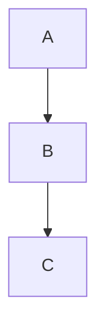

# Docs UI Polish — Tasks

**For this plan:** [[plan]]

> Inline execution. Each phase = one commit. Run `pnpm --filter @zeno/docs dev` (port 4242) for any visual verification; run `pnpm run quality-gate` before each commit. Reference Fumadocs typings (`node_modules/fumadocs-ui/dist/*.d.ts`) when an API shape is ambiguous and capture deviations in a new note in `vault/learnings/`.

---

## Phase 1: Preview route scaffolding

**Commit message:** `chore(docs): scaffold dev-only preview routes`

### Task 1.1: Create preview layout (dev-only gate)

**Files:**
- Create: `apps/docs/src/app/preview/layout.tsx`

- [ ] **Step 1: Write the layout file**

```tsx
import { notFound } from 'next/navigation';
import type { ReactNode } from 'react';

/**
 * Dev-only sandbox for visually verifying components in apps/docs.
 * Production Cloudflare Worker serves notFound() for all /preview/* paths.
 *
 * Routes under this layout exist only to let the maintainer eyeball component
 * variants (OG image, 404, callout palette, shiki theme, banner) without
 * shipping mock pages to docs.zeno-agent.dev.
 */
export default function PreviewLayout({ children }: { children: ReactNode }) {
  if (process.env.NODE_ENV !== 'development') {
    notFound();
  }

  return (
    <div style={{ padding: '2rem', maxWidth: '1200px', margin: '0 auto' }}>
      {children}
    </div>
  );
}
```

- [ ] **Step 2: Verify dev gate works**

Run `pnpm --filter @zeno/docs dev`. Open `http://localhost:4242/preview` — expect 404 (no `page.tsx` yet, but layout gates first).

### Task 1.2: Create preview index page

**Files:**
- Create: `apps/docs/src/app/preview/page.tsx`

- [ ] **Step 1: Write the index**

```tsx
import Link from 'next/link';

const PREVIEW_ROUTES = [
  { href: '/preview/og', label: 'OG image grid (every doc slug + synthetic)' },
  { href: '/preview/not-found', label: '404 page' },
  { href: '/preview/callout', label: 'Callout palette (info/warn/error/success)' },
  { href: '/preview/shiki', label: 'Shiki theme (TS, Bash, JSON, TSX, Markdown)' },
  { href: '/preview/banner', label: 'Banner (isolated)' },
];

export default function PreviewIndex() {
  return (
    <main>
      <h1>Preview routes (dev-only)</h1>
      <p style={{ color: 'var(--color-fd-muted-foreground)' }}>
        These pages exist for visual review during development. They return 404
        in production.
      </p>
      <ul>
        {PREVIEW_ROUTES.map((route) => (
          <li key={route.href}>
            <Link href={route.href}>{route.label}</Link>
          </li>
        ))}
      </ul>
    </main>
  );
}
```

- [ ] **Step 2: Verify in dev**

Open `http://localhost:4242/preview`. Expect a list of 5 links (sub-routes not yet created — clicking returns 404 for now).

- [ ] **Step 3: Verify production gate**

Run `pnpm --filter @zeno/docs build && pnpm --filter @zeno/docs start`. Curl `http://localhost:4242/preview` → expect HTTP 404. Stop the prod server before continuing.

- [ ] **Step 4: Commit**

```bash
git add apps/docs/src/app/preview/
git commit -m "chore(docs): scaffold dev-only preview routes"
```

---

## Phase 2: Wire default MDX components + extras

**Commit message:** `feat(docs): wire default mdx components + extra exports`

### Task 2.1: Create mdx-components.tsx

**Files:**
- Create: `apps/docs/src/mdx-components.tsx`

- [ ] **Step 1: Verify Fumadocs export shape**

Read `node_modules/fumadocs-ui/dist/mdx.d.ts` (or `mdx/index.d.ts`). Confirm `defaultMdxComponents` is the default export. Note the exact set of keys it ships (especially `pre`, `code`, headings, tables) — Phase 6 (Callout) and Phase 7 (Shiki) depend on knowing what's already covered.

- [ ] **Step 2: Write the merge helper**

```tsx
import defaultMdxComponents from 'fumadocs-ui/mdx';
import { InlineTOC } from 'fumadocs-ui/components/inline-toc';
import { Tab, Tabs } from 'fumadocs-ui/components/tabs';
import { File, Files, Folder } from 'fumadocs-ui/components/files';
import { TypeTable } from 'fumadocs-ui/components/type-table';
import { ImageZoom } from 'fumadocs-ui/components/image-zoom';
import type { MDXComponents } from 'mdx/types';

/**
 * Single source of truth for MDX component map. Layout passes the result to
 * the page renderer so every default Fumadocs primitive (code-block copy
 * button, headings with anchor copy, tables, etc.) lights up — and the extra
 * primitives (Tabs, Files, TypeTable, ImageZoom, InlineTOC) are available to
 * any MDX author without per-page imports.
 */
export function getMDXComponents(components?: MDXComponents): MDXComponents {
  return {
    ...defaultMdxComponents,
    InlineTOC,
    Tab,
    Tabs,
    File,
    Files,
    Folder,
    TypeTable,
    ImageZoom,
    ...components,
  };
}
```

If any import path is wrong (Fumadocs may have moved a component), find the correct path via the package's `package.json` `exports` field and adjust. Capture path deviations in `vault/learnings/` if non-obvious.

### Task 2.2: Consume the helper in the page renderer

**Files:**
- Modify: `apps/docs/src/app/[[...slug]]/page.tsx`

- [ ] **Step 1: Update the page component**

Open `apps/docs/src/app/[[...slug]]/page.tsx`. Replace `<MDX components={{}} />` with `<MDX components={getMDXComponents()} />`. Add the import.

Final imports section should include:

```tsx
import { getMDXComponents } from '@/mdx-components';
```

Final body of `<DocsBody>` becomes:

```tsx
<DocsBody>
  <MDX components={getMDXComponents()} />
</DocsBody>
```

- [ ] **Step 2: Verify copy button appears**

Run `pnpm --filter @zeno/docs dev`. Open `http://localhost:4242/install`. Hover any fenced code block (the `curl -fsSL ...` block). A copy button should render in the top-right corner. Click it — clipboard receives the body, button toggles to a "Copied" indicator for ~2s.

- [ ] **Step 3: Verify code-block title meta**

Add a temporary test page or edit one MDX page with a fence like:

````mdx
```bash title="install.sh"
echo hello
```
````

Reload. The block should render with "install.sh" as a title bar above the code. Revert the test edit if you modified a real MDX file.

- [ ] **Step 4: Run quality gate**

```bash
pnpm run quality-gate
```

Expect exit 0.

- [ ] **Step 5: Commit**

```bash
git add apps/docs/src/mdx-components.tsx apps/docs/src/app/[[...slug]]/page.tsx
git commit -m "feat(docs): wire default mdx components + extra exports"
```

---

## Phase 3: CopyMarkdownUrlButton style parity

**Commit message:** `feat(docs): mirror MarkdownCopyButton style on CopyMarkdownUrlButton`

### Task 3.1: Match the button shape

**Files:**
- Modify: `apps/docs/src/components/copy-markdown-url-button.tsx`

**Reference (already verified):** Fumadocs's `MarkdownCopyButton` lives in `fumadocs-ui/dist/layouts/shared/page-actions.js`. Its visual shape is:

```ts
className: cn(buttonVariants({
  color: "secondary",
  size: "sm",
  className: "gap-2 [&_svg]:size-3.5 [&_svg]:text-fd-muted-foreground"
}), props.className)
```

Both `buttonVariants` and `useCopyButton` are exposed via Fumadocs's public exports map:
- `fumadocs-ui/components/ui/button` → `buttonVariants`
- `fumadocs-ui/utils/use-copy-button` → `useCopyButton`

`MarkdownCopyButton` uses a 2-state model: default (`Copy` icon) and `checked` (`Check` icon). It does NOT render a "failed" state — the clipboard promise is allowed to reject. We mirror the 2-state model to keep the buttons indistinguishable. If the clipboard write fails, the button stays in the default state silently; we still catch the rejection to avoid an unhandled promise rejection in dev tools.

- [ ] **Step 1: Rewrite the component**

Replace the entire body of `apps/docs/src/components/copy-markdown-url-button.tsx`:

```tsx
'use client';

import { Check, Link2 } from 'lucide-react';
import { buttonVariants } from 'fumadocs-ui/components/ui/button';
import { useCopyButton } from 'fumadocs-ui/utils/use-copy-button';
import { cn } from 'fumadocs-ui/utils/cn';

/**
 * Copies the absolute URL of the page's raw markdown endpoint to the
 * clipboard. Visually identical to Fumadocs's MarkdownCopyButton except for
 * the icon — so the page-actions row reads as one consistent control surface:
 * [Copy Markdown] [Copy Markdown URL] [Open ▾].
 */
export function CopyMarkdownUrlButton({ markdownUrl }: { markdownUrl: string }) {
  const [checked, onClick] = useCopyButton(async () => {
    const absolute =
      typeof window === 'undefined'
        ? markdownUrl
        : new URL(markdownUrl, window.location.origin).toString();
    await navigator.clipboard.writeText(absolute);
  });

  return (
    <button
      type="button"
      onClick={onClick}
      className={cn(
        buttonVariants({
          color: 'secondary',
          size: 'sm',
          className: 'gap-2 [&_svg]:size-3.5 [&_svg]:text-fd-muted-foreground',
        }),
      )}
    >
      {checked ? <Check /> : <Link2 />}
      Copy Markdown URL
    </button>
  );
}
```

- [ ] **Step 2: Verify the `fumadocs-ui/utils/cn` export**

If the `cn` import path is wrong (the package may export it from `fumadocs-ui/lib/cn` or expose it from another module), find the correct path by reading `node_modules/fumadocs-ui/package.json`'s `exports` field. The most common path is `fumadocs-ui/utils/cn` or `fumadocs-ui/cn`. Capture the resolution.

- [ ] **Step 3: Visual verify alongside the real buttons**

Reload `http://localhost:4242/install` (any docs page). The three buttons in the actions row (`[Copy Markdown] [Copy Markdown URL] [Open ▾]`) should have identical: height, border color, border radius, padding, hover background, transition timing on the "Copied" feedback.

Take a screenshot for the PR description.

- [ ] **Step 4: Run quality gate**

```bash
pnpm run quality-gate
```

- [ ] **Step 5: Commit**

```bash
git add apps/docs/src/components/copy-markdown-url-button.tsx
git commit -m "feat(docs): mirror MarkdownCopyButton style on CopyMarkdownUrlButton"
```

Note: the existing `[[...slug]]/page.tsx` already wraps the button alongside Fumadocs's `MarkdownCopyButton` and `ViewOptionsPopover`. No changes needed in `page.tsx` for this phase.

---

## Phase 4: Experimental Banner

**Commit message:** `feat(docs): experimental banner in DocsLayout`

### Task 4.1: Add Banner to layout

**Files:**
- Modify: `apps/docs/src/app/layout.tsx`
- Create: `apps/docs/src/app/preview/banner/page.tsx`

- [ ] **Step 1: Verify Fumadocs `Banner` API**

Read `node_modules/fumadocs-ui/dist/components/banner.d.ts` (and the `DocsLayout` typings). Confirm whether `DocsLayout` accepts a `banner` prop (likely `ReactNode`) or whether `<Banner>` is rendered as a child. Both shapes have shipped across Fumadocs versions.

- [ ] **Step 2: Update `app/layout.tsx`**

Add the import and the prop. Assuming the `banner` prop on `DocsLayout`:

```tsx
import { Banner } from 'fumadocs-ui/components/banner';
```

Inside `<DocsLayout ...>` props (before `{children}`):

```tsx
banner={
  <Banner>
    Zeno is experimental. Personal project, no SLA, breaking changes expected.
  </Banner>
}
```

Do NOT pass an `id` prop to `<Banner>` — that activates localStorage dismiss state. The banner must stay non-dismissible.

If the API shape requires the banner to be a child instead, restructure accordingly:

```tsx
<DocsLayout ...>
  <Banner>Zeno is experimental. ...</Banner>
  {children}
</DocsLayout>
```

- [ ] **Step 3: Create preview/banner**

```tsx
import { Banner } from 'fumadocs-ui/components/banner';

export default function BannerPreview() {
  return (
    <section>
      <h1>Banner preview</h1>
      <p>Renders the production Banner isolated for contrast review.</p>
      <Banner>
        Zeno is experimental. Personal project, no SLA, breaking changes expected.
      </Banner>
    </section>
  );
}
```

- [ ] **Step 4: Verify on dev server**

Open `http://localhost:4242/install`. Banner renders at the top with the exact copy. No dismiss control. Open `http://localhost:4242/preview/banner` — banner renders standalone for contrast check.

- [ ] **Step 5: Run quality gate**

```bash
pnpm run quality-gate
```

- [ ] **Step 6: Commit**

```bash
git add apps/docs/src/app/layout.tsx apps/docs/src/app/preview/banner/
git commit -m "feat(docs): experimental banner in DocsLayout"
```

---

## Phase 5: Edit-on-GitHub + InlineTOC export

**Commit message:** `feat(docs): edit-on-github + InlineTOC export`

### Task 5.1: Helper for GitHub edit URL (TDD)

**Files:**
- Create: `apps/docs/src/lib/edit-on-github.ts`
- Create: `apps/docs/src/lib/edit-on-github.test.ts`

- [ ] **Step 1: Write the failing test**

```ts
import { describe, expect, it } from 'vitest';
import { editOnGithub } from './edit-on-github';

describe('editOnGithub', () => {
  it('builds the GitHub edit URL from a content-relative path', () => {
    expect(editOnGithub('install.mdx')).toBe(
      'https://github.com/ribeirogab/zeno-agent/edit/main/apps/docs/content/docs/install.mdx',
    );
  });

  it('handles subdirectory paths', () => {
    expect(editOnGithub('guides/quickstart.mdx')).toBe(
      'https://github.com/ribeirogab/zeno-agent/edit/main/apps/docs/content/docs/guides/quickstart.mdx',
    );
  });

  it('strips a leading slash if present', () => {
    expect(editOnGithub('/install.mdx')).toBe(
      'https://github.com/ribeirogab/zeno-agent/edit/main/apps/docs/content/docs/install.mdx',
    );
  });
});
```

- [ ] **Step 2: Run test, expect failure**

```bash
pnpm --filter @zeno/docs test -- edit-on-github
```

Expected: failures — module not found.

- [ ] **Step 3: Implement the helper**

```ts
const REPO = 'https://github.com/ribeirogab/zeno-agent';
const BRANCH = 'main';
const CONTENT_ROOT = 'apps/docs/content/docs';

/**
 * Build a GitHub edit URL for an MDX page given the path Fumadocs reports
 * for that page's source file (e.g. `install.mdx` or `guides/quickstart.mdx`).
 *
 * The URL is composed, not fetched — wraps the page's content path with the
 * repo's edit endpoint so the "Edit on GitHub" link in the page footer
 * resolves to the right file on `main`.
 */
export function editOnGithub(filePath: string): string {
  const normalized = filePath.replace(/^\//, '');
  return `${REPO}/edit/${BRANCH}/${CONTENT_ROOT}/${normalized}`;
}
```

- [ ] **Step 4: Run test, expect pass**

```bash
pnpm --filter @zeno/docs test -- edit-on-github
```

Expected: all 3 tests pass.

### Task 5.2: Wire `editOnGithub` into the page

**Files:**
- Modify: `apps/docs/src/app/[[...slug]]/page.tsx`

- [ ] **Step 1: Verify Fumadocs `DocsPage` accepts `editOnGithub`**

Read `node_modules/fumadocs-ui/dist/page.d.ts`. Confirm the prop name (likely `editOnGithub: { owner, repo, sha, path }` — varies by version). If the API expects an object instead of a URL, adapt the helper output OR pass an object literal that contains the helper's result as `path` or equivalent.

- [ ] **Step 2: Add helper invocation in `Page`**

In `apps/docs/src/app/[[...slug]]/page.tsx`, after `const MDX = page.data.body;`:

```tsx
import { editOnGithub } from '@/lib/edit-on-github';
```

And inside `<DocsPage toc={page.data.toc} ...>` add the prop. The exact shape depends on Step 1's verification. The most common Fumadocs API is:

```tsx
<DocsPage
  toc={page.data.toc}
  editOnGithub={{
    owner: 'ribeirogab',
    repo: 'zeno-agent',
    sha: 'main',
    path: `apps/docs/content/docs/${page.file.path.replace(/^\//, '')}`,
  }}
>
```

If `DocsPage` instead accepts a URL string, use `editOnGithub(page.file.path)` directly. Adjust to whichever shape the typing requires.

- [ ] **Step 3: Verify the link renders**

Reload `http://localhost:4242/install`. Scroll to the footer of the page body. An "Edit on GitHub" link should be present, pointing at `https://github.com/ribeirogab/zeno-agent/edit/main/apps/docs/content/docs/install.mdx`.

Click it (in a browser tab) — GitHub should open the file in its editor.

- [ ] **Step 4: Run quality gate**

```bash
pnpm run quality-gate
```

- [ ] **Step 5: Commit**

```bash
git add apps/docs/src/lib/edit-on-github.ts apps/docs/src/lib/edit-on-github.test.ts apps/docs/src/app/[[...slug]]/page.tsx
git commit -m "feat(docs): edit-on-github + InlineTOC export"
```

Note: `InlineTOC` was already added to the export map in Phase 2 (`mdx-components.tsx`). This commit name covers it because the user-facing change in this phase is the Edit-on-GitHub link; the InlineTOC export piggybacks on Phase 2's commit but is exposed at the same time conceptually.

---

## Phase 6: Bind status tokens to Callout palette

**Commit message:** `feat(docs): bind status tokens to fumadocs callout palette`

### Task 6.1: Update globals.css

**Files:**
- Modify: `apps/docs/src/styles/globals.css`
- Create: `apps/docs/src/app/preview/callout/page.tsx`

**Reference (already verified):** Fumadocs's `Callout` resolves its accent via inline style — `--callout-color: var(--color-fd-${type}, var(--color-fd-muted))`. The component aliases `warn → warning`, so the variant tokens read by the component are:

- `--color-fd-info`
- `--color-fd-warning` (alias for `warn`)
- `--color-fd-error`
- `--color-fd-success`

Because the lookup happens inline on the component, no ID specificity gymnastics are required for callout overrides — a `:root, .dark { ... }` block wins the cascade. The ID-specificity learning ([[../../learnings/fumadocs-css-override-needs-id-specificity|fumadocs-css-override-needs-id-specificity]]) applies only to sidebar / TOC / navbar tokens that Fumadocs re-defines under `.dark #nd-sidebar`.

- [ ] **Step 1: Add the bindings**

Append to `apps/docs/src/styles/globals.css`, before the `::selection` block:

```css
/* Callout palette — info / error / success bind to Imperial status tokens.
   `warn` deliberately untouched: Imperial gold is reserved for affirmative
   actions per /DESIGN.md and the comment at the top of this file. Fumadocs's
   default amber stands for warn (resolved via the `warn → warning` alias
   in the Callout component). */
:root,
.dark {
  --color-fd-info: var(--color-status-info);
  --color-fd-success: var(--color-status-active);
  --color-fd-error: var(--color-status-failed);
}
```

- [ ] **Step 2: Create preview/callout**

```tsx
import { Callout } from 'fumadocs-ui/components/callout';

export default function CalloutPreview() {
  return (
    <section style={{ display: 'flex', flexDirection: 'column', gap: '1rem' }}>
      <h1>Callout palette preview</h1>
      <Callout type="info">Info — should render in Imperial blue ({`#7aa6e8`}).</Callout>
      <Callout type="warn">Warn — should render in Fumadocs default amber.</Callout>
      <Callout type="error">Error — should render in Imperial red ({`#e8617a`}).</Callout>
      <Callout type="success">Success — should render in Imperial green ({`#6bd3a3`}).</Callout>
    </section>
  );
}
```

- [ ] **Step 3: Visual verify**

Open `http://localhost:4242/preview/callout`. Each callout should render with the documented color. Confirm `warn` is amber (Fumadocs default, not gold).

In DevTools, inspect each callout's computed `--callout-color` (on the container element) and verify it resolves to the bound token.

- [ ] **Step 4: Run quality gate**

```bash
pnpm run quality-gate
```

- [ ] **Step 5: Commit**

```bash
git add apps/docs/src/styles/globals.css apps/docs/src/app/preview/callout/
git commit -m "feat(docs): bind status tokens to fumadocs callout palette"
```

---

## Phase 7: Fork github-dark-default shiki theme (Imperial Terminal)

**Commit message:** `feat(docs): fork github-dark-default shiki theme (Imperial Terminal)`

### Task 7.1: Create the theme

**Files:**
- Create: `apps/docs/src/lib/shiki-imperial-terminal.ts`
- Create: `apps/docs/src/app/preview/shiki/page.tsx`
- Modify: `apps/docs/source.config.ts`

- [ ] **Step 1: Source the base theme JSON**

Read `node_modules/shiki/dist/themes/github-dark-default.json` (or wherever the package ships it — may be inside a bundled module). Copy its full structure into a new TypeScript module.

- [ ] **Step 2: Write the theme module**

```ts
import type { ThemeRegistration } from 'shiki';

/**
 * Imperial Terminal shiki theme — forked from github-dark-default.
 *
 * Adjustments:
 * - editor.background → #08090F (canvas, matches the rest of the docs UI)
 * - editor.foreground → #e8eaf5 (Imperial text-primary)
 * - keyword.control / storage.type accent → #d9b362 (Imperial gold, sparingly)
 * - string accent kept desaturated so gold reads as accent, not as a wash
 *
 * Everything else is a verbatim copy of github-dark-default to keep
 * language-by-language coverage robust.
 */
export const imperialTerminalTheme: ThemeRegistration = {
  // PASTE github-dark-default content here, then override the keys above.
  // The `name`, `type`, `colors`, and `tokenColors` fields are required.
  // ...
};
```

The implementer pastes the base JSON, then surgically overrides the four points above. Keep the file under 200 lines if possible — the override is small relative to the base.

- [ ] **Step 3: Register the theme in source.config.ts**

```ts
import { type DocsCollection, defineConfig, defineDocs } from 'fumadocs-mdx/config';
import { imperialTerminalTheme } from '@/lib/shiki-imperial-terminal';

export const docs: DocsCollection = defineDocs({
  dir: 'content/docs',
  docs: {
    postprocess: {
      includeProcessedMarkdown: true,
    },
  },
});

export default defineConfig({
  mdxOptions: {
    rehypeCodeOptions: {
      themes: {
        dark: imperialTerminalTheme,
      },
      // Twoslash transformer is added in Phase 11.
    },
  },
});
```

Verify the exact key name (`themes` vs `theme`) and shape against `node_modules/fumadocs-mdx/dist/config.d.ts` or the runtime types — Fumadocs MDX 15 vs 17 differ here.

- [ ] **Step 4: Create preview/shiki**

```tsx
export default function ShikiPreview() {
  return (
    <section>
      <h1>Shiki theme preview</h1>
      <p>Five representative languages with the Imperial Terminal theme.</p>

      <h2>TypeScript</h2>
      <pre><code className="language-ts">{`export function greet(name: string): string {
  const greeting = \`Hello, \${name}\`;
  return greeting;
}`}</code></pre>

      <h2>Bash</h2>
      <pre><code className="language-bash">{`#!/usr/bin/env bash
curl -fsSL https://zeno-agent.dev/install.sh | sh
echo "done"`}</code></pre>

      <h2>JSON</h2>
      <pre><code className="language-json">{`{
  "name": "@zeno/docs",
  "private": true,
  "version": "0.0.1"
}`}</code></pre>

      <h2>TSX</h2>
      <pre><code className="language-tsx">{`export function Crest({ size = 28 }: { size?: number }) {
  return <svg width={size} height={size} viewBox="0 0 120 120" />;
}`}</code></pre>

      <h2>Markdown</h2>
      <pre><code className="language-md">{`# Heading

A paragraph with [a link](https://example.com).

- bullet one
- bullet two`}</code></pre>
    </section>
  );
}
```

Note: this preview uses raw `<pre><code>` to embed snippets without authoring real MDX. The actual shiki rendering on production pages happens via the MDX pipeline; this preview is for the theme JSON only — to verify the theme JSON is valid and renders, also click through to an actual docs page (`/install`) and confirm the code blocks there pick up the new theme.

- [ ] **Step 5: Visual verify**

Open `http://localhost:4242/install` (real MDX rendering). Editor background should be `#08090F`. At least one `keyword.control` token (e.g. `if`, `return`, `export`) should render in Imperial gold (`#d9b362`).

Open `http://localhost:4242/preview/shiki` for the side-by-side language sample.

- [ ] **Step 6: Run quality gate**

```bash
pnpm run quality-gate
```

- [ ] **Step 7: Commit**

```bash
git add apps/docs/src/lib/shiki-imperial-terminal.ts apps/docs/src/app/preview/shiki/ apps/docs/source.config.ts
git commit -m "feat(docs): fork github-dark-default shiki theme (Imperial Terminal)"
```

---

## Phase 8: Dynamic OG image per slug

**Commit message:** `feat(docs): dynamic OG image per slug + preview`

### Task 8.1: Create the OG route

**Files:**
- Create: `apps/docs/src/app/[[...slug]]/opengraph-image.tsx`
- Create: `apps/docs/src/app/preview/og/page.tsx`

- [ ] **Step 1: Write the OG generator**

```tsx
import { ImageResponse } from 'next/og';
import { notFound } from 'next/navigation';
import { source } from '@/lib/source';

/**
 * Per-slug OG image. Reads title and description from frontmatter, renders
 * them on the Imperial Terminal palette with a Crest mark and brand bar.
 * 1200×630 — standard Twitter/OG size.
 *
 * Next.js auto-wires `og:image` and `twitter:image` to this route for every
 * matching slug. No metadata change required in `page.tsx`.
 */
export const size = { width: 1200, height: 630 };
export const contentType = 'image/png';

export default async function OGImage({
  params,
}: {
  params: Promise<{ slug?: string[] }>;
}) {
  const { slug } = await params;
  const page = source.getPage(slug);
  if (!page) notFound();

  const title = page.data.title;
  const description = page.data.description ?? '';

  return new ImageResponse(
    (
      <div
        style={{
          height: '100%',
          width: '100%',
          display: 'flex',
          flexDirection: 'column',
          justifyContent: 'space-between',
          backgroundColor: '#08090F',
          padding: '64px',
          color: '#e8eaf5',
          fontFamily: 'sans-serif',
        }}
      >
        {/* Brand bar — gold accent line at the top */}
        <div
          style={{
            display: 'flex',
            alignItems: 'center',
            gap: '16px',
          }}
        >
          {/* Crest, inlined as SVG */}
          <svg width="48" height="48" viewBox="0 0 120 120" fill="none">
            <path
              d="M60 6 L114 60 L60 114 L6 60 Z"
              stroke="#d9b362"
              strokeWidth="3"
              fill="none"
            />
            <g fill="#d9b362">
              <rect x="36" y="42" width="48" height="8" />
              <polygon points="76,50 84,50 44,70 36,70" />
              <rect x="36" y="70" width="48" height="8" />
            </g>
          </svg>
          <span style={{ fontSize: '28px', fontWeight: 600, color: '#e8eaf5' }}>
            zeno
          </span>
        </div>

        {/* Title + description */}
        <div style={{ display: 'flex', flexDirection: 'column', gap: '16px' }}>
          <div
            style={{
              fontSize: '72px',
              fontWeight: 700,
              color: '#e8eaf5',
              lineHeight: 1.1,
            }}
          >
            {title}
          </div>
          {description ? (
            <div
              style={{
                fontSize: '32px',
                color: '#8a8fab',
                lineHeight: 1.3,
                maxWidth: '90%',
              }}
            >
              {description}
            </div>
          ) : null}
        </div>

        {/* Footer brand bar */}
        <div
          style={{
            display: 'flex',
            alignItems: 'center',
            justifyContent: 'space-between',
            color: '#4b4f66',
            fontSize: '22px',
          }}
        >
          <span>docs.zeno-agent.dev</span>
          <span style={{ color: '#d9b362' }}>Personal agent · Self-hosted</span>
        </div>
      </div>
    ),
    {
      ...size,
      // Workers cannot fetch remote fonts at runtime. If next/font/google fonts
      // need to be embedded explicitly, fetch their bytes inside this route
      // (Next.js supports `fonts: [...]` in the ImageResponse options). For the
      // first iteration, system-fallback sans-serif is acceptable and the
      // Imperial palette carries the brand.
    },
  );
}
```

- [ ] **Step 2: Verify the route works for a real slug**

Run `pnpm --filter @zeno/docs dev`. Request:

```bash
curl -sI http://localhost:4242/install/opengraph-image
```

Expect HTTP 200, `Content-Type: image/png`. Render in a browser tab to eyeball.

- [ ] **Step 3: Confirm Next.js wires the metadata**

Open `http://localhost:4242/install` and view source. The `<head>` should include:

```html
<meta property="og:image" content="http://localhost:4242/install/opengraph-image" />
<meta name="twitter:image" content="http://localhost:4242/install/opengraph-image" />
```

(URLs may include cache-busting query strings; the path is the verification target.)

- [ ] **Step 4: Add a synthetic frontmatter-less-description test page**

Add a temporary MDX under `apps/docs/content/docs/` named `_preview-og-no-description.mdx` with only:

```mdx
---
title: Test page with no description
---

Test body.
```

Confirm `curl -sI http://localhost:4242/_preview-og-no-description/opengraph-image` returns 200 with a valid PNG that renders the title alone.

**Delete this file before the commit** — the spec forbids mutating real content. The verification is single-use; the preview route in the next task covers ongoing visual regression for missing description.

Alternative (preferred): create the synthetic page under `apps/docs/src/app/preview/og/synthetic/` as an iframe target instead of touching `content/docs/`. Implementer's call.

- [ ] **Step 5: Create preview/og**

```tsx
import { source } from '@/lib/source';

/**
 * Grid of OG images, one per real doc slug. Lets the maintainer eyeball
 * every card in one screen without opening 12 browser tabs.
 */
export default function OGPreview() {
  const slugs = source.generateParams();

  return (
    <section>
      <h1>OG image preview</h1>
      <p>Every doc slug, plus a synthetic slug with no description.</p>
      <div
        style={{
          display: 'grid',
          gridTemplateColumns: 'repeat(2, minmax(0, 1fr))',
          gap: '1rem',
        }}
      >
        {slugs.map((entry) => {
          const slugPath = entry.slug ? `/${entry.slug.join('/')}` : '';
          return (
            <figure key={slugPath || 'root'}>
              
              <figcaption style={{ fontSize: '0.85rem', color: 'var(--color-fd-muted-foreground)' }}>
                {slugPath || '/'}
              </figcaption>
            </figure>
          );
        })}
      </div>
    </section>
  );
}
```

- [ ] **Step 6: Visual verify in browser**

Open `http://localhost:4242/preview/og`. All slugs render their cards in a grid. Each card shows title + description + Crest + gold accent.

- [ ] **Step 7: Run quality gate**

```bash
pnpm run quality-gate
```

- [ ] **Step 8: Commit**

```bash
git add apps/docs/src/app/[[...slug]]/opengraph-image.tsx apps/docs/src/app/preview/og/
git commit -m "feat(docs): dynamic OG image per slug + preview"
```

---

## Phase 9: Custom 404

**Commit message:** `feat(docs): custom 404 with crest + search + preview`

### Task 9.1: Create the 404 page

**Files:**
- Create: `apps/docs/src/app/not-found.tsx`
- Create: `apps/docs/src/app/preview/not-found/page.tsx`

**Reference (already verified):** Fumadocs 16.8.8 does not export a stand-alone `<SearchToggle>` from `fumadocs-ui`. Instead, it exposes the search dialog via a hook: `useSearchContext()` (from `fumadocs-ui/contexts/search`) returns `{ enabled, open, hotKey, setOpenSearch }`. The provider is wired by `RootProvider` (already in `app/layout.tsx`), so the 404 page — rendered inside the root layout — has access to the context.

Build a thin custom trigger button that calls `setOpenSearch(true)` on click.

- [ ] **Step 1: Write the 404 page**

```tsx
'use client';

import Link from 'next/link';
import { Search } from 'lucide-react';
import { useSearchContext } from 'fumadocs-ui/contexts/search';
import { buttonVariants } from 'fumadocs-ui/components/ui/button';
import { cn } from 'fumadocs-ui/utils/cn';
import { Crest } from '@/components/crest';

/**
 * Custom 404 — Imperial Terminal voice. Crest + factual headline + search
 * trigger + single home link. No oops/emoji/large 404 numeral, no hard-coded
 * shortcut links (those rot when pages get renamed).
 *
 * Triggers the Fumadocs search dialog via setOpenSearch from the context
 * supplied by RootProvider in app/layout.tsx.
 */
export default function NotFound() {
  const { setOpenSearch, hotKey } = useSearchContext();

  return (
    <main
      style={{
        minHeight: '60vh',
        display: 'flex',
        flexDirection: 'column',
        alignItems: 'center',
        justifyContent: 'center',
        gap: '1.5rem',
        textAlign: 'center',
        padding: '4rem 1rem',
      }}
    >
      <Crest size={64} />
      <h1 style={{ fontSize: '2rem', fontWeight: 600, margin: 0 }}>
        Page not found
      </h1>
      <p style={{ color: 'var(--color-fd-muted-foreground)', maxWidth: '36ch', margin: 0 }}>
        The page you requested does not exist or has been moved. Try search or
        head back to the docs home.
      </p>
      <button
        type="button"
        onClick={() => setOpenSearch(true)}
        className={cn(
          buttonVariants({
            color: 'secondary',
            size: 'sm',
            className: 'gap-2',
          }),
        )}
      >
        <Search size={14} aria-hidden />
        <span>Search docs</span>
        {hotKey?.[0]?.display ? (
          <kbd style={{ marginLeft: '0.25rem', fontSize: '0.75em', opacity: 0.7 }}>
            {hotKey[0].display}
          </kbd>
        ) : null}
      </button>
      <Link
        href="/"
        style={{
          color: 'var(--color-fd-foreground)',
          textDecoration: 'underline',
        }}
      >
        ← Back to docs
      </Link>
    </main>
  );
}
```

If `useSearchContext()` throws when search is disabled or not provided (e.g., during a build pass that pre-renders the 404), wrap the hook call in a try/catch or branch on `enabled`. The Fumadocs implementation returns `{ enabled: false, ... }` in that case, so a guard like `if (!enabled) hide the trigger` is the safer shape.

- [ ] **Step 2: Create preview/not-found**

```tsx
import NotFound from '@/app/not-found';

export default function NotFoundPreview() {
  return (
    <section>
      <h1>404 page preview</h1>
      <p>Renders the production 404 inline for visual review.</p>
      <hr />
      <NotFound />
    </section>
  );
}
```

- [ ] **Step 3: Verify the 404**

Curl `http://localhost:4242/this-route-does-not-exist`. Expect HTTP 404 with body containing the literal string `Page not found`.

Open the URL in a browser. Crest renders, headline + subtitle + search + link all visible. No oops/emoji/large numerals.

Open `http://localhost:4242/preview/not-found` for the embedded preview.

- [ ] **Step 4: Run quality gate**

```bash
pnpm run quality-gate
```

- [ ] **Step 5: Commit**

```bash
git add apps/docs/src/app/not-found.tsx apps/docs/src/app/preview/not-found/
git commit -m "feat(docs): custom 404 with crest + search + preview"
```

---

## Phase 10: Mermaid wiring

**Commit message:** `chore(docs): wire mermaid via fumadocs-core mdx-plugins`

### Task 10.1: Register the Mermaid plugin

**Files:**
- Modify: `apps/docs/source.config.ts`
- Modify: `apps/docs/package.json`

- [ ] **Step 1: Install mermaid**

```bash
pnpm --filter @zeno/docs add mermaid
```

Verify the install reports no `@zeno/docs`-attributed peer warnings.

- [ ] **Step 2: Register the plugin in `source.config.ts`**

Read `node_modules/fumadocs-core/dist/mdx-plugins/index.d.ts` to find the exact export name (`remarkMermaid`, `mermaidPlugin`, etc.) and signature.

Update `source.config.ts`:

```ts
import { remarkMermaid } from 'fumadocs-core/mdx-plugins';
// ...

export default defineConfig({
  mdxOptions: {
    remarkPlugins: [remarkMermaid],
    rehypeCodeOptions: {
      themes: { dark: imperialTerminalTheme },
    },
  },
});
```

If `fumadocs-core` does not export a Mermaid plugin under this name, check `fumadocs-docgen`, `fumadocs-mdx`, or use the third-party `remark-mermaidjs` package — capture the resolution in `vault/learnings/`.

- [ ] **Step 3: Verify with a temp MDX**

Add a temporary fence to any existing MDX page (or create `_test-mermaid.mdx` and delete it after):

````mdx

````

Reload the page. An SVG diagram should render in place of the code block. Remove the temp content.

- [ ] **Step 4: Run quality gate**

```bash
pnpm run quality-gate
```

- [ ] **Step 5: Commit**

```bash
git add apps/docs/source.config.ts apps/docs/package.json pnpm-lock.yaml
git commit -m "chore(docs): wire mermaid via fumadocs-core mdx-plugins"
```

---

## Phase 11: Twoslash wiring

**Commit message:** `chore(docs): wire twoslash for ts hover`

### Task 11.1: Register the Twoslash transformer

**Files:**
- Modify: `apps/docs/source.config.ts`
- Modify: `apps/docs/package.json`

- [ ] **Step 1: Install fumadocs-twoslash**

```bash
pnpm --filter @zeno/docs add fumadocs-twoslash
```

Verify peer alignment — `fumadocs-twoslash` should accept `fumadocs-core@^16.7.0` (the locked triple). If it requires `^17`, capture the conflict and either pin a compatible older version or defer wiring (open follow-up issue).

- [ ] **Step 2: Add the transformer**

Read `node_modules/fumadocs-twoslash/dist/index.d.ts` to find the transformer export (commonly `transformerTwoslash` or default).

Update `source.config.ts`:

```ts
import { transformerTwoslash } from 'fumadocs-twoslash';
// ...
import 'fumadocs-twoslash/twoslash.css';

export default defineConfig({
  mdxOptions: {
    remarkPlugins: [remarkMermaid],
    rehypeCodeOptions: {
      themes: { dark: imperialTerminalTheme },
      transformers: [transformerTwoslash()],
    },
  },
});
```

The `twoslash.css` import wires the popover styles. Add it where global stylesheets are imported (`src/app/layout.tsx` or `src/styles/globals.css` via `@import` if the package's CSS supports it).

- [ ] **Step 3: Verify with a temp twoslash block**

Add to any MDX page temporarily:

````mdx
```ts twoslash
const greeting = 'hello' as const;
//    ^?
```
````

Reload. Hover the `^?` line — expect a popover showing the inferred type. Remove the temp content.

- [ ] **Step 4: Run quality gate**

```bash
pnpm run quality-gate
```

- [ ] **Step 5: Commit**

```bash
git add apps/docs/source.config.ts apps/docs/package.json apps/docs/src/app/layout.tsx pnpm-lock.yaml
git commit -m "chore(docs): wire twoslash for ts hover"
```

---

## Phase 12: R2 incremental cache + observability

**Commit message:** `chore(docs): cf worker R2 incremental cache + dedupe routes key`

### Task 12.1: Create the R2 bucket

**Files:** none in repo — Cloudflare account state change.

- [ ] **Step 1: Create the bucket**

```bash
wrangler r2 bucket create zeno-docs-isr-cache
```

If the bucket already exists (re-run), Cloudflare's CLI returns a notice without failing. Confirm the bucket is visible via:

```bash
wrangler r2 bucket list
```

Document the bucket name in the PR description.

### Task 12.2: Wire R2 in OpenNext config

**Files:**
- Modify: `apps/docs/open-next.config.ts`
- Modify: `apps/docs/wrangler.jsonc`

- [ ] **Step 1: Verify OpenNext-Cloudflare R2 export shape**

Read `node_modules/@opennextjs/cloudflare/dist/api/overrides/incremental-cache/r2-incremental-cache.d.ts` (path may vary by version). Identify the exact export (`r2IncrementalCache`, `R2IncrementalCache`, etc.) and the option shape.

- [ ] **Step 2: Update `open-next.config.ts`**

```ts
import { defineCloudflareConfig } from '@opennextjs/cloudflare';
import r2IncrementalCache from '@opennextjs/cloudflare/overrides/incremental-cache/r2-incremental-cache';

export default defineCloudflareConfig({
  incrementalCache: r2IncrementalCache,
});
```

Adjust paths/exports to match what Step 1 reveals.

- [ ] **Step 3: Update `wrangler.jsonc`**

Open `apps/docs/wrangler.jsonc`. Make three changes:

1. Remove the duplicate `routes` key (lines 24 and 33 currently both declare it). Keep one.
2. Add the R2 binding:

```jsonc
"r2_buckets": [
  {
    "binding": "NEXT_INC_CACHE_R2_BUCKET",
    "bucket_name": "zeno-docs-isr-cache"
  }
]
```

3. Verify `observability.enabled: true` remains. Do not touch it.

Final shape (preserving existing keys, with R2 + single routes):

```jsonc
{
  "$schema": "node_modules/wrangler/config-schema.json",
  "name": "zeno-docs",
  "main": ".open-next/worker.js",
  "account_id": "9890bc74ec17df307df583147a6ea97f",
  "compatibility_date": "2025-03-01",
  "compatibility_flags": ["nodejs_compat", "global_fetch_strictly_public"],
  "assets": {
    "directory": ".open-next/assets",
    "binding": "ASSETS"
  },
  "routes": [
    { "pattern": "docs.zeno-agent.dev", "custom_domain": true }
  ],
  "observability": {
    "enabled": true
  },
  "r2_buckets": [
    {
      "binding": "NEXT_INC_CACHE_R2_BUCKET",
      "bucket_name": "zeno-docs-isr-cache"
    }
  ]
}
```

- [ ] **Step 4: Build locally**

```bash
pnpm --filter @zeno/docs cf:build
```

Expect a successful build. Watch the logs for R2 binding resolution.

- [ ] **Step 5: Preview deploy (optional but recommended)**

```bash
pnpm --filter @zeno/docs preview
```

The preview should hit R2 for cached ISR content. If the binding fails at runtime, recheck Steps 1–3.

- [ ] **Step 6: Verify preview routes still return 404 in build mode**

```bash
pnpm --filter @zeno/docs build && pnpm --filter @zeno/docs start
curl -sI http://localhost:4242/preview/og
```

Expect HTTP 404 (per the dev-only gate). Stop the server when done.

- [ ] **Step 7: Run quality gate**

```bash
pnpm run quality-gate
```

- [ ] **Step 8: Commit**

```bash
git add apps/docs/open-next.config.ts apps/docs/wrangler.jsonc
git commit -m "chore(docs): cf worker R2 incremental cache + dedupe routes key"
```

---

## Phase 13: README correction

**Commit message:** `docs(docs): readme correction (pagefind + next 15 → 16)`

### Task 13.1: Fix the two factual errors

**Files:**
- Modify: `apps/docs/README.md`

- [ ] **Step 1: Replace `Pagefind`**

Open `apps/docs/README.md`. Find the "Built with Fumadocs (Next.js 15 + MDX) and Pagefind for local search." line. Replace with:

```markdown
# @zeno/docs

Outsider-facing documentation site for Zeno. Built with Fumadocs (Next.js 16 + MDX) and Fumadocs's built-in Orama search (served at `/api/search`).
```

(Adjust the rest of the README only if other Pagefind references survive.)

- [ ] **Step 2: Sanity check**

```bash
grep -n -i pagefind apps/docs/README.md
grep -n "Next.js 15" apps/docs/README.md
```

Both should return zero matches.

- [ ] **Step 3: Run quality gate**

```bash
pnpm run quality-gate
```

- [ ] **Step 4: Commit**

```bash
git add apps/docs/README.md
git commit -m "docs(docs): readme correction (pagefind + next 15 → 16)"
```

---

## Final verification (before PR)

- [ ] Run the full quality gate one more time:

```bash
pnpm run quality-gate
```

- [ ] Manually verify each AC in [[spec]] against the running dev server.

- [ ] Open `http://localhost:4242/preview` and click each sub-route — every one should render cleanly.

- [ ] Build for prod and confirm every `/preview/*` route returns 404:

```bash
pnpm --filter @zeno/docs build
pnpm --filter @zeno/docs start
for path in / preview preview/og preview/not-found preview/callout preview/shiki preview/banner; do
  echo "GET /$path"
  curl -sI "http://localhost:4242/$path" | head -n1
done
```

- [ ] Open `/new-pr` skill to draft the PR. Title: `feat(docs): UI polish — copy button, OG, 404, banner, callout/shiki bindings, plumbing`. Body summarizes the 13 phases and links the spec.

- [ ] After merge, deploy and verify `https://docs.zeno-agent.dev/preview/og` returns HTTP 404 in production.

- [ ] Run the "After completing a spec" reflection (from `CLAUDE.md`): if any non-obvious gotcha came up during implementation (Fumadocs API drift, OpenNext-Cloudflare R2 quirks, NODE_ENV semantics on Workers), create atomic notes in `vault/learnings/` and link them to this spec.
